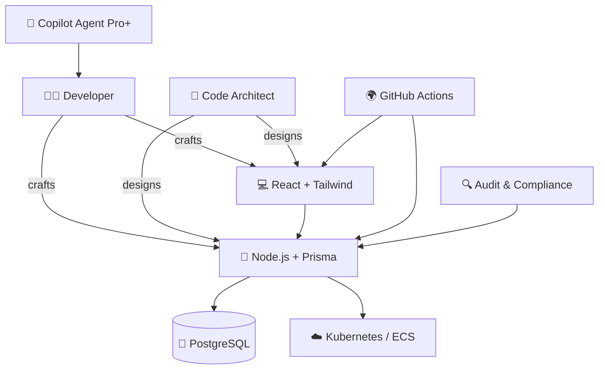

<h1 align="center">🧠 Neil Munoz Lago – Code Architect · Freelance Senior Developer</h1>

<p align="center">
  <strong>Neil Muñoz Lago (@Neiland85)</strong><br>
  🧠 Code Architect · 🔁 Automation Strategist · 🤖 GitHub Copilot Agent Expert · ☁️ Cloud-Native Builder
</p>

<p align="center">
  
  
  
  
  
  
</p>

---

## 🇬🇧 About Me (English)

Hi! I'm Neiland — a fullstack architect and solo engineer with 15+ years of experience in scalable systems, DevOps automation, and AI-powered development.

I specialize in designing high-performance architectures from scratch with legal traceability, GitHub Copilot Pro+ workflows, and modern SaaS practices.

---

## 👨‍💻 I specialize in:

- 🧱 **Monorepo architecture** for SaaS and microservices
- 🤖 **GitHub Copilot Agent + Pro** for real-world prompt engineering
- 🚢 **CI/CD pipelines**, **Kubernetes**, observability, and infrastructure as code
- 🔍 **Audit-ready automation** with Zapier, Hubspot, Slack and backend bridges
- ⚙️ **Rapid MVPs** using Node.js, TypeScript, React, Prisma, and Python

---

## 🧠 My Architectural Mindset (Visual)


```bash
code-architect-freelance-senior/
├── README.md                         # Main professional showcase (EN/ES)
├── LICENSE
├── .gitignore
├── stack/
│   └── stack.md                      # Full description of personal tech stack
├── philosophy/
│   └── philosophy.md                 # Philosophy and cultural approach
├── prompts-copilot/
│   ├── copilot-k8s.md
│   ├── copilot-monorepo.md
│   └── ...
├── settings/
│   ├── settings.json
│   ├── .devcontainer.json
│   └── ...
├── cases/
│   └── idealista-backend-devops-2012-2014/
│       ├── README.md
│       ├── button-then-vs-now.md
│       └── architecture-idealista-transition.md
└── templates/
    ├── README-template.md
    ├── ADR-template.md
    └── ...
```

## 🧬 Philosophy

> **Asian Methodology – German Execution – Spanish Ingenuity**  
> _(Metodología asiática · Ejecución alemana · Picardía española)_

My work style blends:

- 🧘 *Asian discipline*: precision, long-term thinking, clean process  
- 🛠 *German rigor*: structured systems, reproducibility, reliability  
- 🎭 *Spanish cleverness*: adaptive thinking, bold pragmatism, creative fire

---

## 📂 Featured Projects & Gists

- 🧠 [Copilot Prompts for Kubernetes & VS Code](https://gist.github.com/Neiland85/2bd47ad2e4c962a0e61a4cb6e1073ed5)  
- ⚙️ [My VS Code Settings for Monorepos & Copilot](https://gist.github.com/Neiland85/8c87abae66c70fe43d08bf3006bdd541)  
- 🔁 [Auditable Webhook Bridge (Zapier → Slack)](https://gist.github.com/Neiland85/ea03236ecdfc5636e9706421b85e224b)

---

### 📂 Featured Case: **Idealista (2012–2014)**

A deep-dive into the architecture, interface logic, and backend evolution during a critical phase in one of Europe’s most important real estate platforms.

- 🏛️ [Experience Summary](https://github.com/Neiland85/code-architect-freelance-senior/blob/main/cases/idealista-ui-2012-2014/README.md)  
  Overview of my role in backend + interface architecture, business logic, and REST transition.

- 🔘 [UI Pattern – Favorite Button: Then vs Now](https://github.com/Neiland85/code-architect-freelance-senior/blob/main/cases/idealista-ui-2012-2014/button-then-vs-now.md)  
  Side-by-side comparison of a real 2013 interface vs a 2025 React + Tailwind version.

- 🧱 [Architecture – From Monolith to Modular REST](https://github.com/Neiland85/code-architect-freelance-senior/blob/main/cases/idealista-ui-2012-2014/architecture-idealista-transition.md)  
  Mermaid diagram and explanation of the architectural shift I lived and helped implement.

> 🧠 This case shows how I moved from executing logic to **designing systems**, and why that matters for any architect today.

---

## 📞 Contact

- 📧 LinkedIn: [linkedin.com/in/neiland85](https://linkedin.com/in/neiland85)  
- 📱 WhatsApp / Phone: **+34 613 722 441**  
- 🧪 Gists: [gist.github.com/Neiland85](https://gist.github.com/Neiland85)  
- 📦 Project repo: [kopstadium-monorepo-official](https://github.com/Neiland85/kopstadium-monorepo-official)

---

## 🇪🇸 Sobre Mí (Español)

¡Hola! Soy Neiland, arquitecto de software y desarrollador senior con más de 15 años de experiencia en sistemas escalables, automatización DevOps y flujos de trabajo asistidos por IA.

Diseño arquitecturas desde cero con trazabilidad legal, principios de excelencia técnica y mentalidad open source.

---

## 👨‍💻 Especialidades:

- 🧱 Arquitectura monorepo para SaaS y microservicios
- 🤖 Ingeniería de prompts con GitHub Copilot Pro+ en proyectos reales
- 🚢 Pipelines CI/CD, Kubernetes, observabilidad, infra como código
- 🔍 Automatización trazable legal (Slack, Hubspot, Zapier, backends propios)
- ⚙️ MVPs documentados con Node.js, React, Prisma, TypeScript y Python

---

## 🧬 Filosofía de Trabajo

> **Metodología asiática · Ejecución alemana · Picardía española**

Fusiono:

- 🧘 Disciplina asiática → precisión, largo plazo, sobriedad técnica  
- 🛠 Rigor alemán → sistemas estructurados, calidad auditable  
- 🎭 Picardía española → agilidad creativa, soluciones inteligentes, intuición estratégica

---

## 📂 Casos y Demos

- 🧠 [Prompts Copilot para Kubernetes y VS Code](https://gist.github.com/Neiland85/2bd47ad2e4c962a0e61a4cb6e1073ed5)  
- ⚙️ [VS Code Settings para Monorepo y Copilot Agent](https://gist.github.com/Neiland85/8c87abae66c70fe43d08bf3006bdd541)  
- 🔁 [Handler legal Zapier → Slack](https://gist.github.com/Neiland85/ea03236ecdfc5636e9706421b85e224b)

---

### 📂 Caso destacado: **Idealista (2012–2014)**

Una inmersión real en la lógica de interfaces, evolución arquitectónica y trabajo backend durante una fase crítica de transformación en una de las plataformas inmobiliarias más influyentes de Europa.

- 🏛️ [Resumen de experiencia](./cases/idealista-ui-2012-2014/README.md)  
- 🔘 [Comparativa UI – Botón de favoritos](./cases/idealista-ui-2012-2014/button-then-vs-now.md)  
- 🧱 [Evolución arquitectónica: de monolito a REST modular](./cases/idealista-ui-2012-2014/architecture-idealista-transition.md)

---

## 📞 Contacto

- 📧 LinkedIn: [linkedin.com/in/neiland85](https://linkedin.com/in/neiland85)  
- 📱 WhatsApp / Teléfono: **+34 613 722 441**  
- 🧪 Gists: [gist.github.com/Neiland85](https://gist.github.com/Neiland85)  
- 📦 Proyecto en curso: [kopstadium-monorepo-official](https://github.com/Neiland85/kopstadium-monorepo-official)
