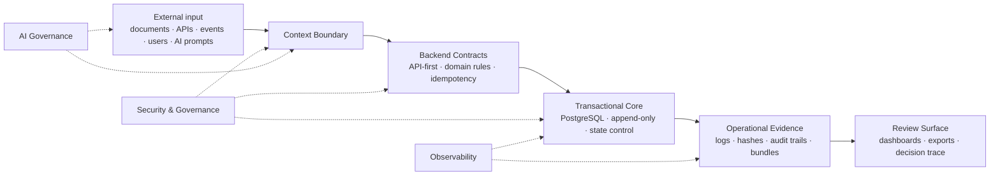

<p align="center">
  
  
  
</p>

<h1 align="center">Neil Muñoz Lago</h1>

<h3 align="center">
Critical Systems & Backend Architect<br/>
Operational Evidence · Traceability · Security · AI Governance
</h3>

<p align="center">
Madrid · Clarity Structures Digital S.L. · <a href="https://app.claritystructures.com/es">app.claritystructures.com/es</a><br/>
<a href="mailto:admin@claritystructures.com">admin@claritystructures.com</a> · <a href="https://www.linkedin.com/in/neiland85">LinkedIn</a>
</p>

---

## What I build

I design backend and platform systems where failure, ambiguity or duplicated events cannot be allowed to silently corrupt the operation.

My work focuses on systems that must be able to answer, after the fact:

- what happened;
- when it happened;
- which input, event, decision or integration produced the state;
- which version of the policy, code or process was active;
- what can be verified without relying on memory or narrative.

> **A good system does not only run. It can explain what happened when it fails.**

---

## Operating map


```mermaid
flowchart LR
    A[External input<br/>documents · APIs · events · users · AI prompts] --> B[Context Boundary]
    B --> C[Backend Contracts<br/>API-first · domain rules · idempotency]
    C --> D[Transactional Core<br/>PostgreSQL · append-only · state control]
    D --> E[Operational Evidence<br/>logs · hashes · audit trails · bundles]
    E --> F[Review Surface<br/>dashboards · exports · decision trace]

    G[Security & Governance] -.-> B
    G -.-> C
    G -.-> D
    H[Observability] -.-> D
    H -.-> E
    I[AI Governance] -.-> A
    I -.-> B
```

---

## Engineering focus

| Area | What I care about |
|---|---|
| Backend architecture | API-first systems, bounded contexts, transactional boundaries, clean service contracts |
| Data integrity | PostgreSQL, idempotency, append-only flows, replay safety, rollback behaviour |
| Operational evidence | SHA-256 traces, audit logs, evidence bundles, technical custody, export discipline |
| AI governance | Prompt/payload inspection, source control, human review, quarantine, traceable decisions |
| Security & reliability | secrets hygiene, permissions, OWASP thinking, safe deployment, observability, post-incident reconstruction |
| Technical leadership | reducing noise, making systems legible, separating demo, prototype, pilot and production claims |

---

## Selected public work

| Repository | Signal | What it demonstrates |
|---|---|---|
| [`claritystructures-webapp`](https://github.com/Neiland85/claritystructures-webapp) | Operational intake & governance | Privacy-aware intake, context classification, consent, derivation flows and traceability |
| [`evidence-system`](https://github.com/Neiland85/evidence-system) | Evidence custody | Append-only custody model, WORM-oriented storage ideas and verifiable exports |
| [`clarity-asset-governance-hub`](https://github.com/Neiland85/clarity-asset-governance-hub) | Asset governance | Technical evidence, remediation tracking, SHA-256 integrity and review-ready documentation |
| [`snapshot-runner-railway-demo`](https://github.com/Neiland85/snapshot-runner-railway-demo) | Reproducible validation | Controlled execution, smoke checks and security-oriented reproducibility |

Private/NDA work includes deeper portfolio material around critical backend, DDD, evidence vaults, AI-facing governance and integration assurance.

---

## Critical systems, without overclaiming

When I say **critical systems**, I do not mean every system is military, certified or regulated by default.

I mean systems where one broken assumption can create operational, legal, reputational or data-integrity damage.

That usually means:

- duplicated events must not corrupt state;
- a decision must be reconstructable;
- a manual process needs to become traceable;
- AI must not access internal context without permission boundaries;
- logs, hashes and events must support later review;
- the architecture must survive technical scrutiny without a PowerPoint story holding it together.

---

## Technical stack

<p align="center">
  
  
  
  
  
  
</p>

**Backend & architecture:** Java/Spring Boot, Python/FastAPI, TypeScript/Node.js, NestJS, REST APIs, DDD, hexagonal architecture, microservices, event-driven systems.  
**Data & infrastructure:** PostgreSQL, Redis, Docker, Kubernetes, Linux, CI/CD, GitHub Actions, Terraform/Ansible foundations.  
**Reliability & governance:** idempotency, audit trails, structured logs, traceability, security review, privacy-aware flows, AI governance controls.

---

## Review posture

I prefer small, defensible changes over decorative architecture.

```text
Does it run?
Can it be explained?
Can it be reviewed?
Can the state be reconstructed?
Does the commit tell the truth?
Would the diff survive hostile senior review?
```

If the answer is no, the architecture is not finished.

---

## Current positioning

**Spanish:** Arquitecto de Sistemas Críticos y Backend especializado en trazabilidad operativa, evidencia técnica, seguridad, integración y gobernanza IA.  
**English:** Critical Systems & Backend Architect focused on operational evidence, traceability, security, integration and AI governance.

---

## Working principle

> **Before claiming, preserve.**  
> **Before interpreting, trace.**  
> **Before delivering, make it explainable.**

No se trata de creer.  
Se trata de poder verificar.
