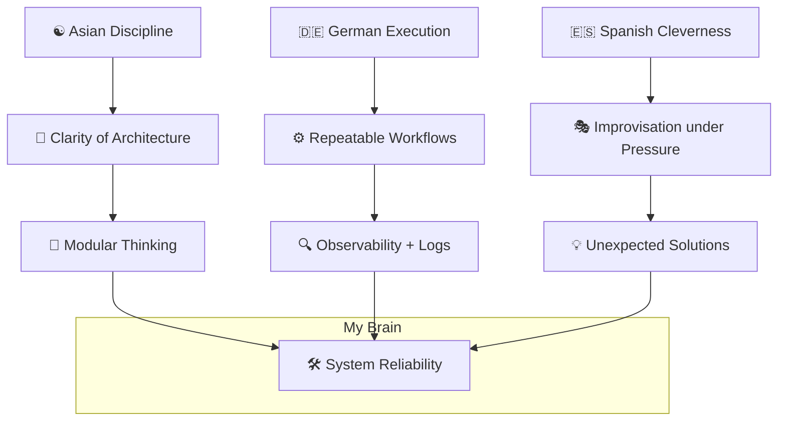

# 🧬 Philosophy — Neil Muñoz Lago

> *"Discipline builds clarity. Clarity builds systems. But systems are worthless without instinct."*

I don't just write code. I architect behavior — human and machine.  
And I do it with a cultural mix that most CVs can't capture.

---

## 🧘 My Operating System (in real life)

### 🧭 Core Principles

- **Asian Methodology** → long-term strategy, minimalism, and patience  
- **German Execution** → precision, auditability, reproducibility  
- **Spanish Ingenuity** → boldness, adaptive creativity, and lateral problem-solving

> I don't just build systems that work. I build systems that *endure* — under chaos, change, and deadlines.

---

#### 🎭 Architectural Mindset: Cultural Stack (Mermaid)

##### 💥 Philosophy applied to tech
Principle	Translation in code
Asian Discipline	KISS + BDD + README-driven development
German Execution	Clean architecture + CI/CD + contract testing
Spanish Ingenuity	Polyglot hacks + unusual stack combos + fast MVPs

###### 🔁 Bonus: When to break the rules
Break modularity? ✅ When product needs speed > elegance

Ignore DRY? ✅ If it means code is easier to read

Challenge the spec? ✅ Always — if the spec ignores human reality

####### 🔥 Final word
If it’s not ethical, traceable, and fast — I don’t ship it.
If it is… brace yourself.

Architecture is not a diagram. It’s a worldview.
And mine has three roots: Asia, Alemania, España.
