# ⚙️ VS Code & DevContainer Settings

This folder contains the core configuration files for my development environment, optimized for:

- GitHub Copilot Pro+ + Agent
- Monorepos with TypeScript, Tailwind, Prisma
- Full support for DevContainers (Node.js, Docker, Kubernetes)
- Clean terminal defaults and linting presets

## 🧩 Files

| File               | Purpose                                           |
|--------------------|---------------------------------------------------|
| `settings.json`    | VS Code global + workspace settings               |
| `.devcontainer.json` | Reproducible container-based dev environment     |
| `launch.json` _(optional)_ | Debugging setup for Node, Jest, etc.         |
| `tasks.json` _(optional)_  | Predefined CLI workflows for lint/test/dev  |

---

> These settings are designed for speed, reproducibility, and AI-augmented workflows in professional environments.

### 🧠 VS Code Behavior Diagram

```mermaid
graph TD
  VSCode["🖥️ VS Code"]
  Copilot["🤖 GitHub Copilot Pro+"]
  Agent["🧠 Copilot Agent"]
  Linter["🚨 ESLint + Prettier"]
  Tailwind["🎨 Tailwind CSS"]
  Terminal["💻 Zsh Shell"]
  Workspace["📦 Monorepo Workspace"]

  VSCode --> Copilot
  Copilot --> Agent
  VSCode --> Linter
  VSCode --> Tailwind
  VSCode --> Terminal
  VSCode --> Workspace
```



---

### ✅ 2. `settings/.devcontainer.json`

#### 📄 Descripción visual en Mermaid

```md
### 📦 DevContainer Environment Map
```

```mermaid
graph TD
  DevContainer["🐳 DevContainer"]
  Node["🟢 Node.js 18"]
  Docker["📦 Docker-in-Docker"]
  GitHubCLI["🔗 GitHub CLI"]
  K8s["☸️ kubectl + Helm"]
  Extensions["🧩 VS Code Extensions"]

  DevContainer --> Node
  DevContainer --> Docker
  DevContainer --> GitHubCLI
  DevContainer --> K8s
  DevContainer --> Extensions
```

