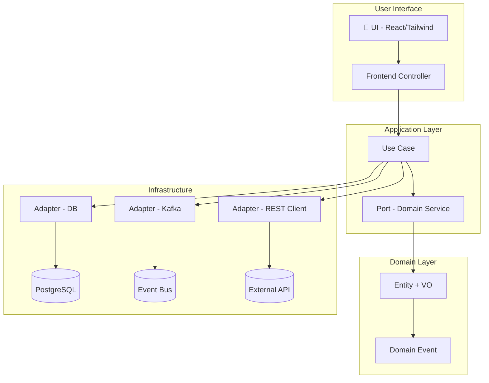

# 🧱 My Technical Stack — Neil Muñoz Lago

A real-world, production-proven stack optimized for building scalable SaaS platforms, backend architectures, and DevOps pipelines — as a solo engineer or Code Architect leading complex automation.

---

## 🧠 Mindset: Build clean, traceable, and scalable systems

- 📐 Domain-Driven Design (DDD) + Hexagonal Architecture
- 🧩 Modular monorepos with clear boundaries (Turborepo, Nx)
- 🧪 Everything testable: Jest, Playwright, Vitest
- 🔍 Always auditable: structured logs, observability, legal traceability
- 🤖 GitHub Copilot Pro+ + prompt engineering for architecture, automation, testing

---

## 💻 Core Languages

| Language     | Purpose                      |
|--------------|------------------------------|
| **TypeScript** | Fullstack logic, APIs, tools |
| **JavaScript** | UI & small automation        |
| **Python**     | Bots, scraping, data tools   |
| **Bash/Zsh**   | CLI, server automation       |
| **SQL (PostgreSQL)** | Schema modeling, queries |

---

## 🧱 Backend & API

- **Node.js (18.x)** — server logic, APIs
- **Express / Fastify** — REST endpoints
- **Prisma ORM** — typed access to PostgreSQL
- **OpenAPI 3.1** — contracts + validation
- **Zod / Joi** — schema validation
- **JWT / OAuth2** — authentication

---

## 🎨 Frontend Stack

- **React** — interfaces and SPAs
- **Next.js (v13+)** — fullstack SSR/ISR apps
- **Tailwind CSS** — utility-first design system
- **Radix UI / shadcn/ui** — accessible UI components
- **Framer Motion** — animation and microinteractions

---

## ☁️ Cloud & Infrastructure

- **AWS** (ECS Fargate, S3, SES, CloudWatch)
- **Docker** — containerized local dev & deployment
- **Terraform** — IaC for reproducible environments
- **GitHub Actions** — CI/CD pipelines
- **Supabase / Turso / SQLite** — fast backends & edge DBs

---

## ⚙️ DevOps & Observability

- **Prometheus + Grafana + Loki** — metrics and logs
- **Elastic APM** — app-level performance traces
- **Eslint / Prettier / SonarLint** — code quality automation
- **ADR + Markdown + Mermaid** — decision documentation

---

## 🧩 Software Architecture: Hexagonal + DDD + Microservices

I build systems that are decoupled, business-centric and long-term maintainable.

### 🛠 Hexagonal Architecture

- Core domain logic is isolated from external concerns
- Adapters connect the system to DBs, APIs, or event buses
- Application logic orchestrates the domain via explicit ports
- Makes systems highly testable, modular, and resilient

src/
├── domain/ # Entities, Value Objects, business logic
├── application/ # Use cases, orchestrators, ports
├── infrastructure/ # DB clients, Kafka, HTTP APIs
├── interfaces/ # Controllers: REST, GraphQL, CLI
└── main.ts # Entry point with DI container

### 📐 DDD Applied

- Bounded contexts per business capability
- Explicit use of aggregates, domain events, and value objects
- Event-driven interactions between services (Kafka / RabbitMQ)
- Database-per-service with schema isolation
- CQRS where necessary

#### 📦 Microservices

- Services own their domain and data
- OpenAPI + schema validation for external APIs
- Communication via REST or async events
- CI/CD per service, infrastructure as code (Terraform)

---

##### 🧠 Architecture Diagram (Mermaid)

##### 🧰 Tools & Workflow

Tool	Role
VS Code	Dev environment with Copilot Pro
Postman	API testing
Jest / Vitest	Unit testing
Playwright	End-to-end tests
Figma / Whimsical	Design & system sketching
Markdown + Mermaid	Docs & architecture

####### 🔐 Security & Legal Compliance

Encrypted secret management (.env, Parameter Store)

Audit-ready logs and flows (Slack, Zapier, Hubspot)

Flows with webhook validation, schema enforcement, endpoint signing

Biometric login & token strategies (FIDO2 / JWT)

######## 💡 Why this stack?

Because it's:

✅ Scalable and decoupled

✅ Solo-developer and enterprise-friendly

✅ Modular, composable, resilient

✅ Legally traceable and AI-compatible

"Clarity wins. Decoupling is power. Architecture is a language between humans and systems."
